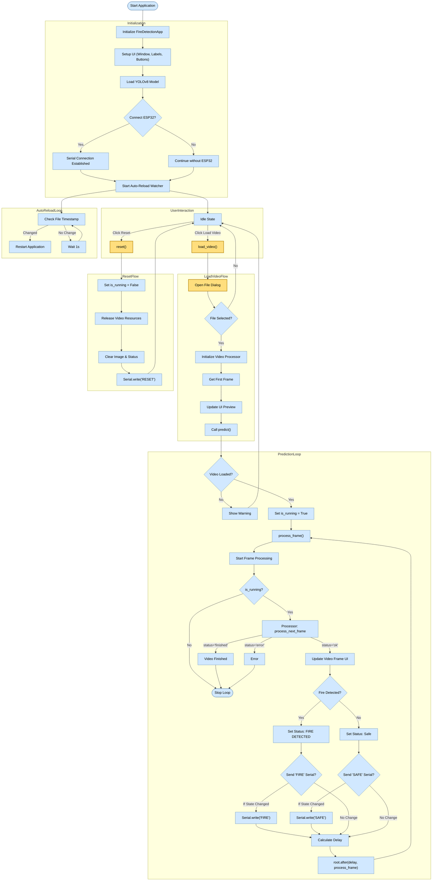

```mermaid
flowchart TD
    Start(["Start Application"]) --> Init["Initialize FireDetectionApp"]
    
    subgraph Initialization
        Init --> SetupUI["Setup UI (Window, Labels, Buttons)"]
        SetupUI --> LoadModel["Load YOLOv8 Model"]
        LoadModel --> ConnectESP{"Connect ESP32?"}
        ConnectESP -- Yes --> ESPConnected["Serial Connection Established"]
        ConnectESP -- No --> ESPFailed["Continue without ESP32"]
        ESPConnected --> AutoReload["Start Auto-Reload Watcher"]
        ESPFailed --> AutoReload
    end

    AutoReload --> Idle["Idle State"]

    subgraph UserInteraction
        Idle --> |Click Load Video| LoadVideo["load_video()"]
        Idle --> |Click Reset| Reset["reset()"]
    end

    subgraph LoadVideoFlow
        LoadVideo --> SelectFile["Open File Dialog"]
        SelectFile --> CheckFile{"File Selected?"}
        CheckFile -- No --> Idle
        CheckFile -- Yes --> InitVideo["Initialize Video Processor"]
        InitVideo --> GetPreview["Get First Frame"]
        GetPreview --> UpdatePreview["Update UI Preview"]
        UpdatePreview --> StartPredict["Call predict()"]
    end

    subgraph PredictionLoop
        StartPredict --> CheckVideo{"Video Loaded?"}
        CheckVideo -- No --> ShowWarning["Show Warning"] --> Idle
        CheckVideo -- Yes --> SetRunning["Set is_running = True"]
        SetRunning --> ProcessFrame["process_frame()"]
        
        ProcessFrame --> ProcStart["Start Frame Processing"]
        ProcStart --> CheckRunning{"is_running?"}
        CheckRunning -- No --> StopLoop(["Stop Loop"])
        
        CheckRunning -- Yes --> RunAI["Processor: process_next_frame"]
        RunAI -- status='finished' --> VideoEnd["Video Finished"] --> StopLoop
        RunAI -- status='error' --> VideoError["Error"] --> StopLoop
        RunAI -- status='ok' --> UpdateImg["Update Video Frame UI"]
        
        UpdateImg --> CheckFire{"Fire Detected?"}
         CheckFire -- Yes --> FireTrue["Set Status: FIRE DETECTED"]
         FireTrue --> SendFire{"Send 'FIRE' Serial?"}
         SendFire -- If State Changed --> SerialFire["Serial.write('FIRE')"]
         
        CheckFire -- No --> FireFalse["Set Status: Safe"]
        FireFalse --> SendSafe{"Send 'SAFE' Serial?"}
        SendSafe -- If State Changed --> SerialSafe["Serial.write('SAFE')"]
        
        SerialFire --> CalcDelay["Calculate Delay"]
        SerialSafe --> CalcDelay
        SendFire -- No Change --> CalcDelay
        SendSafe -- No Change --> CalcDelay
        
        CalcDelay --> ScheduleNext["root.after(delay, process_frame)"]
        ScheduleNext --> ProcessFrame
    end

    subgraph ResetFlow
        Reset --> StopRunning["Set is_running = False"]
        StopRunning --> ReleaseVideo["Release Video Resources"]
        ReleaseVideo --> ClearUI["Clear Image & Status"]
        ClearUI --> SendReset["Serial.write('RESET')"]
        SendReset --> Idle
    end

    subgraph AutoReloadLoop
        AutoReload --> CheckTime["Check File Timestamp"]
        CheckTime -- Changed --> Restart["Restart Application"]
        CheckTime -- No Change --> Wait["Wait 1s"] --> CheckTime
    end

    %% Styles
    classDef user fill:#ffde7d,stroke:#b8860b,stroke-width:2px,color:black;
    classDef auto fill:#d1e8ff,stroke:#5c87b2,stroke-width:1px,color:black;

    %% Apply Styles
    class LoadVideo,Reset,SelectFile user;
    class Start,Init,SetupUI,LoadModel,ConnectESP,ESPConnected,ESPFailed,AutoReload,Idle,CheckFile,InitVideo,GetPreview,UpdatePreview,StartPredict,CheckVideo,ShowWarning,SetRunning,ProcessFrame,ProcStart,CheckRunning,StopLoop,RunAI,VideoEnd,VideoError,UpdateImg,CheckFire,FireTrue,SendFire,SerialFire,FireFalse,SendSafe,SerialSafe,CalcDelay,ScheduleNext,StopRunning,ReleaseVideo,ClearUI,SendReset,CheckTime,Restart,Wait auto;
```
